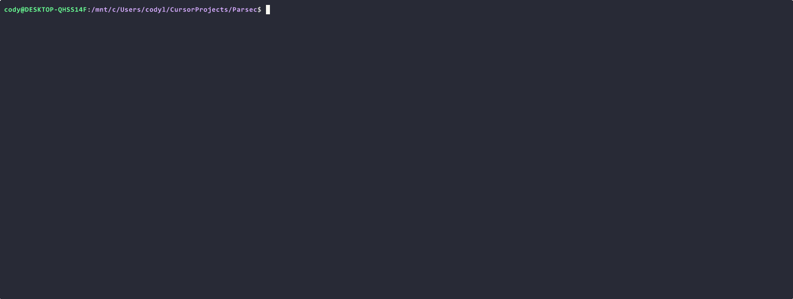

# Parsec: Terminal-Based File Summarizer TUI

Parsec is a fast, terminal-based file inspector that provides immediate summaries of source code files. Built for developers who need rapid context-aware code browsing.

## Demo



*Parsec's split-screen interface showing file summaries and executable help display*

## Features

- Split-screen interface with file tree and detailed summary view
- Directory navigation with live content preview
- Real-time fuzzy search capabilities
- Multi-language support: Go, Python, JavaScript, TypeScript, Rust, Java, C/C++
- Enhanced file parsing:
  - Markdown rendering with syntax highlighting
  - Configuration file parsing (JSON, YAML, INI, ENV)
  - Text file preview with line counts
  - Executable help text extraction
- Intelligent parsing of functions, imports, types, and structs
- Responsive design with terminal resize handling
- Keyboard-driven interface with vim-style bindings
- Asynchronous operations for smooth performance

## Installation

### From Binary Release (Recommended)

1. Download the appropriate zip file for your platform from the [Releases](#releases) section
2. Extract the executable from the zip file
3. Make it executable (Linux/macOS only):
   ```bash
   chmod +x parsec
   ```
4. Run the application:
   ```bash
   ./parsec [directory]
   ```

### From Source

```bash
git clone https://github.com/Cod-e-Codes/parsec.git
cd parsec
go build .
```

## Usage

```bash
# Scan current directory
./parsec

# Scan specific directory
./parsec /path/to/project

# Windows paths
./parsec "C:\Users\username\Projects"

# Unix paths
./parsec /home/user/code

# Show help
./parsec -h
```

## Keyboard Controls

| Key | Action |
|-----|--------|
| `↑/↓` or `k/j` | Navigate file list |
| `Enter` | Enter directory or open file |
| `/` | Start fuzzy search |
| `PgUp/PgDn` | Scroll summary content |
| `Home/End` | Jump to first/last file |
| `t` | Toggle directory visibility |
| `r` | Refresh current directory |
| `q` or `Ctrl+C` | Quit |

## Supported File Types

| Category | Extensions | Features |
|----------|------------|-----------|
| Programming | `.go` `.py` `.js` `.ts` `.rs` `.java` `.c` `.cpp` `.cc` | Functions, types, imports |
| Documentation | `.md` `.markdown` `.rst` | Headers, links, rendered content |
| Configuration | `.json` `.yaml` `.ini` `.env` | Keys, structure |
| Data | `.xml` `.csv` `.log` | Content preview |
| Executables | `.exe` `.bin` | Help text extraction |

## Project Structure

```
parsec/
├── main.go             # Application entrypoint
├── ui/                 # Interface components
├── core/               # Analysis engine
├── utils/              # Utilities
└── docs/              # Documentation
```

## Contributing

Parsec welcomes contributions from the community. Please review our contribution guidelines before getting started:

- [Code of Conduct](CODE_OF_CONDUCT.md)
- [Contributing Guidelines](CONTRIBUTING.md)
- [Security Policy](SECURITY.md)

### Development Process

1. Fork the repository
2. Create a feature branch
3. Make your changes
4. Test thoroughly
5. Submit a pull request

### Reporting Issues

When reporting bugs, please include:
- Operating system details
- Steps to reproduce
- Expected vs actual behavior
- Error messages if applicable

## Security

For security concerns, please review our [Security Policy](SECURITY.md) before submitting a report.

## Dependencies

Dependencies are managed through Go modules and automatically updated via Dependabot. Major version updates are handled manually to ensure stability.

## License

MIT License - see [LICENSE](LICENSE) file for details.

## Releases

### v0.2.0 (13 Aug 2025)
**Commit:** 146795a

**Key Changes:**
- **UI Fix**: Resolved left-hand file tree width misalignment for entries missing icons or spaces
- **Code Quality**: Eliminated duplicate `getFileIcon` functions by moving to shared `utils/ui.go`
- **Maintainability**: Improved code organization and reduced duplication by ~100 lines

**Assets:**
- [parsec-v0.2.0-linux-amd64.zip](releases/parsec-v0.2.0-linux-amd64.zip) (6.8 MB)
- [parsec-v0.2.0-darwin-amd64.zip](releases/parsec-v0.2.0-darwin-amd64.zip) (6.7 MB)
- [parsec-v0.2.0-windows-amd64.zip](releases/parsec-v0.2.0-windows-amd64.zip) (7.1 MB)

### v0.1.0-alpha
Initial alpha release with core functionality.

## Versioning

Parsec follows semantic versioning. The first stable release will be tagged as v1.0.0 once all core features are thoroughly tested. 
